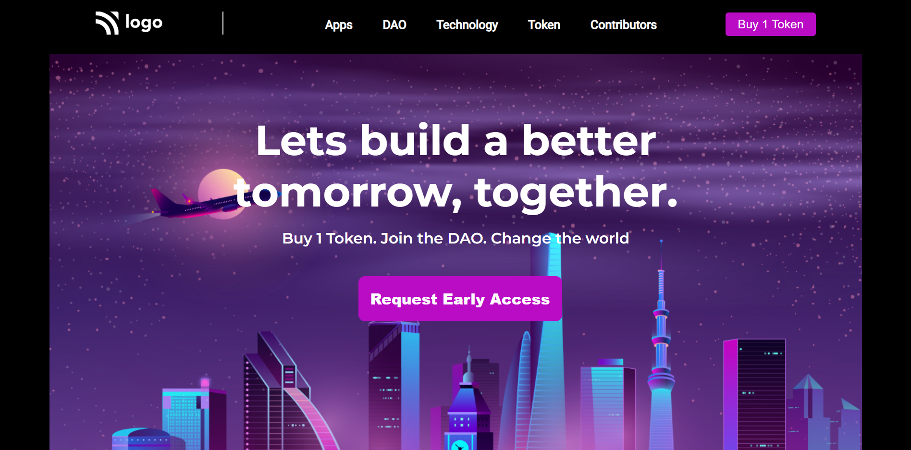

# Project 05 - HTML and CSS

By Piyush Bhatt

Deployed link of website &nbsp; 

 

# [Link to Project 05](token-access.netlify.app)

 

# Preview of the Project.

 

## What I learnt in this Project?

- I learned how to use **Background Property**.
- I also learnt about how to make beautiful **buttons**.
- I also learnt how to create and **navbar**and and how to **border** between logo and navbar.

  

# Time Taken to complete  this project is 2.5  hour.